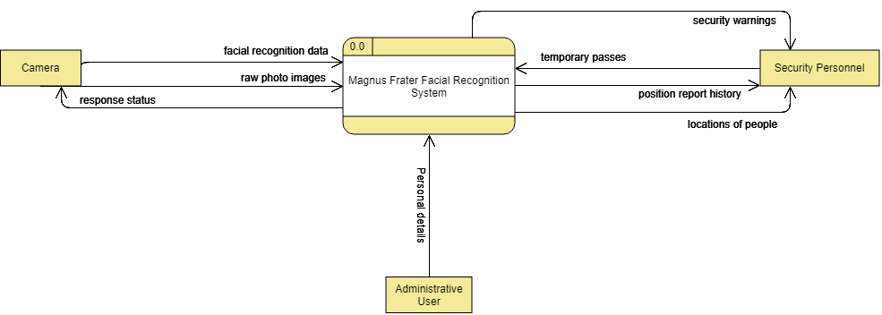

---
title: "PPM Project Report - Group Kii"
author: [Callum Axon (N0727303), Callum Carney (N0741707), Jordan Brightmore (N0732961), Finlay McKinnon (N0743587), Vital Harachka (N0731739), Wing Chiang (T0086366)]
subtitle: "Magnus Frater System"
lang: "en"
logo: "./images/ntu-logo.png"
logo-width: 60
linkcolor: darkgray
titlepage: true
titlepage-color: "06386e"
titlepage-text-color: "FFFFFF"
titlepage-rule-color: "FFFFFF"
titlepage-rule-height: 1
header-includes: |
	\usepackage{pdflscape}
...

[comment]: <> (pandoc --filter pandoc-citeproc --bibliography=./references.bib -s ppm.md -o project.pdf --template eisvogel)

# Abstract

Magnus Frater (or Big Brother) has been created to help tackle the ongoing issue of security within large open campuses and premises, these sorts of locations inherently have an increased potential for intrusion through unmonitored sections of land. The group analysed the recent spree of attacks on schools and offices - for example the shooting that occurred at the YouTube headquarters in 2018 [@agencies_2018] - and found that in a large amount of these attacks there were open doors and spaces that allowed the attacker to enter with ease. As a consequence to this, the idea of creating a facial recognition system to analyse and report known and unknown people within a campus/large open setting was conceived.

As mentioned, the main purpose of the project was to create a system that would accurately detect and report people walking around an area to the associated security team, this data would differentiate between employees or authorised users and unknown people by linking into the companies employee/student database. Not only would this allow a security team to monitor who is within a set area at any one time, but it would also allow administrative users to track any persons movements and activities within a set time frame, through tracking of the targets face across multiple cameras. Another advantage to this project is that administrative users can view analytics in relation to the usage of campus properties, an example use case for this would be within a University. Admins could check what buildings within the campus are being utilised most by students.  

After the main purpose behind the project was defined, the group decided on how to proceed in regards to the requirements for the project, most importantly how we should proceed with splitting up the individual hardware and software components so that the system could functions within any scenario or environment. It was decided that there will be 4 different modules, these being:

1. A Raspberry Pi that would be responsible for processing any facial data that is captured by the camera
2. A Camera module that would connect directly to the Raspberry Pi and provide images to the Raspberry Pi
3. A website created for administrators and security personnel to administer and manage hits/rejections.
4. An API (Application Programming Interface) used within the website and the Raspberry Pi for collation and provision of data.

These modules will work together to create the Cameras that report facial data and the web interface that is used to manage the data received by the camera, the connection between these modules was outlined in the design documentation (for example the Data Flow Diagram and Entity Relationship Diagram).

Once the components and requirements were completed, the group began to consider which programming languages and setups would be best suited for the type of project this is (Facial Recognition with Web Related components). It was clear that Python should be used for the facial recognition section of the project due to its strong existing libraries. NodeJS would be used for the Web Frontend, PHP would be used to power the backend API that links all of the components together and the API would be using a MySQL database to hold all of the data. The system would work in the following way:

1. The Camera feeds data to the Raspberry Pi
2. The Python application on the Raspberry Pi calculates if a face is present
3. Any potential face found is sent to the API where corresponding facial data is requested from the database
4. If no corresponding data is found, then the face is unknown, otherwise the image will be linked to the person the face associates with.
5. The Website will update using data from the API to show new detections, known or unknown.

Once the product had been developed, testing took place to ensure that the facial recognition software worked from a variety of different distances and in unfavourable circumstances (heavy rain, fog, etc). While some of the tests passed, others failed to detect faces when they were present, however this only occurred in extreme circumstances. We made small enhancements to the facial detection algorithm to improve its effectiveness during these scenarios.

Due to the nature of this system, there are a lot of potential legal and ethical issues, people may not consent to the recording of their faces, people may not wish to have their faces processed and stored by this system. Therefore it was important for us to implement a blacklist system that would stop the system from performing facial data processing, however, this is a complex system because we first need to process a persons face to understand what to blacklist, which could cause further legal or ethical issues. 

\newpage

# Table of Contents
- [Abstract](#abstract)
- [Table of Contents](#table-of-contents)
- [Introduction](#introduction)
	- [Aims](#aims)
	- [Objectives](#objectives)
- [Requirements](#requirements)
	- [Functional Requirements](#functional-requirements)
	- [Non-Functional Requirements](#non-functional-requirements)
- [Normalisation](#normalisation)
- [Context Diagram](#context-diagram)
	- [BCS Code of Conduct](#bcs-code-of-conduct)
- [References](#references)

\newpage

# Introduction

## Aims
The main aim of the project is to provide organisations with open campus settings a way to effectively track and monitor who is on campus and where they are located at any time of day. This is to help reduce or prevent intrusions and attacks that occur on these types of locations.

## Objectives

To ensure clear and appropriate objectives have been created for the project, the S.M.A.R.T. (specific, measurable, achievable/appropriate, realistic, time-constrained) goals [@doran1981there] were used. SMART allows us to create objectives that provide the project with lots of functionality, that will be meaningful to the objects, and still stay within the projects deadlines. For the project to be successful the following objectives should be met:

Staff Members should be able to:

* Add new faces or people to the system through a simple yet effective web interface 
* Monitor the movements of people across buildings and campuses, whether they are registered as people or not
* Manage alerts of unknown people entering the campus
* Provide temporary passes to unknown people to authorize them for a set amount of time;

As a requirement to this, the camera and associated Raspberry Pi module should be able to provide the following:

* A stream of video that can be analysed by the algorithm on the Pi in order to find faces;
* A constant stream of face detections to the central server that manages all hits;

In general the following objective should be met:

* The camera and web interface should be able to talk to each other through an API (Application Programming Interface)

To meet the objectives set out for Staff Members, the group will be creating a web interface using NodeJS, this interface will have the functionality set out above and will interface with the API to get and set data. It was mentioned that the interface should be simple yet effective, we could easily bombard the user with a lot of metadata from the cameras, however, the web interface will only show the required information and actions to ensure that a staff member can quickly and easily identify if there is an intruder currently on campus. All of the outlines objectives are achievable and can be implemented in a timely manner.

To meet the requirements set out for the Raspberry Pi and API, we will have to ensure substantial testing of the facial detection algorithm takes place, the group wants to avoid experiencing a scenario in which multiple people are not identified. However, the algorithm cannot be 100% effective, there will always be scenarios in which the algorithm misses a person, or mis-identifies them, it would be unrealistic and a waste of development time to be chasing after a 100% success rate. We will also have to ensure that the API is tested thoroughly, not only for functionality, but for security purposes, if an attacker gained access to another users facial data then this would be a breach of GDPR, therefore we will be implementing multiple security procedures to ensure that the API is secure, including the use of security based unit testing and manual testing.

\newpage

# Project Management

## Meetings
Group meetings should occur at least once a week during term
time.This may be altered and increased dependent on any deadlines
that the group decide are enough of an impact to call extra meetings.
The current meetings have an estimated length of 30 minutes to an hour,
being held in a work-appropriate environment, such as a meeting room. IT can be useful to utilise software which allows the use of voice communication to enable remote working.
It is possible that there will be instances in which not all the group will
be able to meet. This may be caused through a great many scenario, each
of which should be able to be resolved, given consideration and following a
standard procedure. Some of the scenarios, and correct procedures to take
in the event of said scenario, can be seen below:

### General Absence
In the case of a general absence, being that a member of the group is absent
without meaningful reason, the group may have to consider the situation
the absent member may be in. The consideration being the current group
position, the importance of the absent member’s role, or contribution that
may have been needed in the current session. In this event, the group may
need to note down the general absence and keep track of the amount each
member has committed, as many of these may show a lack of commitment
to the project. A given example of this scenario is - ”Marcus missed the
meeting because he went to go see a movie.”

### Authorised Absence

In the event of an authorised absence, in which the member who is absent has
given compelling reason and possibly proof if required, the member would
be excused from the current session. For this scenario to be distinguishable
from a general absence is down to a few possibilities: forewarning of absence
with given reasoning and a group consensus to pass this absence, an event in
which the member would not be able to attend due to reasoning outside of
their control, or an unavoidable event where the member has no real ability
to alter A given example of this scenario is - ”Jess couldn’t make it to the
meeting as she had a medical appointment.”

### Absence Procedure

In either of the circumstances mentioned above, the same procedure is taken.
This is to ensure that the missing member will be able to catch up on the
meeting that they missed, allowing for minimal drawbacks from the absence.
For a team member to be considered ’fully informed, for the meeting of
absence, the team must follow the stages below. A team member(s) who was
present in said meeting must contact the absentee, giving a small briefing
as well as the minutes of the meeting. This should be followed with any
decisions or changes decided within the meeting, if not already noted down
in the minuets. Furthermore, the absentee should be asked if they have
any questions about the information given to them, to ensure that they are
sound minded on the group’s current position, as well as each individual’s
tasks.

## Management

### Project Manager

A member should be elected as Project Manager (PM), the role responsible
to tracking information on the group members, as well as being the first to
act on any events which may disrupt the project. PM will handle the attendance
of the group during all forms of meetings, as well as the punctuality
of tasks from each of the group. It will be the PM’s duty to talk to any
members who show deviation from a consistent work ethic, ensuring that
the member knows their tasks and is on track. If the PM finds the need to
call a discussion with the group on a member’s behaviour and commitment
toward the project they can initiate a vote to exclude the member from the
group, with warning and consultation. The PM may find it useful to pass off a secondary role to another team member to ensure that the project is
being fully watched. The deputy should report back to the PM with any
extra information they have found to be added to their current information
on the group.

### Task Allocation

For the group to work as well as they can with minimal conflict, when a
task is presented to the group they will be asked to whom would like to take
on said task. If there is a conflict on the task allocation, it may be able
to split the task into smaller subtasks; thus, allowing for multiple members
to work on it. However, if the situation does not allow for this then a
fair discussion will be made to decide which member will be assigned the
task. Upon being assigned a task, the member will be given a deadline
for the task to be complete, the deadline may be flexible, allowing for the
member to negotiate and discuss with the team. When each member of the
team is working on a task, the PM will ask for progress reports at intervals
throughout each task. The PM will report to the team if any anomalies
occur, allowing the team to propose ideas to ensure completion before its
deadline.

\newpage

## Team Members, Responsibility & Skills

**Project Manager**: Callum Axon 

| Name | Responsible For | Relevant Skills |
| ---- | --------------- | --------------- |
| Callum Axon | Backend Database & API | - PHP - MySQL - UML Tooling - Testing - Server Management |
| Callum Carney | Monitoring Application | - HTML & CSS - JavaScript, Testing |
| Finlay McKinnon | Monitoring Application | - HTML & CSS - Screen & Graphic Design |
| Jordan Brightmore | Facial Recognition Software | Python - Machine Learning - Raspiban - Computer Vision |
| Vital Harachka | Backend Database | SQL - PHP |
| Wing Lam Chiang | Documentation & Database | SQL - PHP - Project Management Software
\newpage

# Risk Assessment

| ID  | Description | Impact | Probability | Response |
| --- | ----------- | ------ | ----------- | -------- |
| RE1 | Team member is ill, injured or cannot work on project due to personal reasons| High | Low | Reorganise workload to cover team member. |
| RE2 | Team member attend meetings due to a busy university schedule | Medium | Low | Organise more meetings at a common available time. Alternatively, use a digital solution |
| RE3 | Team member consistently not doing work, time schedule falls at least a week behind | High | Medium | Assign multiple members to the same task - enabling redundancy |
| RE4 | Data Loss | High | Medium | Ensure a regular backup of work is taken. Use version control systems (VCS) for code & store in cloud. |
| RE5 | Deadline Changes | Medium | Low | If deadline is earlier than before, change work schedule to account
for it. |
| RE6 | Missed Internal Deadlines | Very High | Low | Workload reorganised to complete project ahead of schedule, meetings to identify problems causing missed deadlines. |

\newpage

# Requirements
 
## Functional Requirements

| FR# | Function      | Goal  | Actor | Justification | Importance Rating (out of 5) |
| --- | --------------- | --------------- | --------- | ----------------- | ------------------ |
| 1   | Face Scanning | A stationary camera is able to detect a face and scan certain data points for analysis | Stationary Camera |In order to provide a product that tracks people on a large campus, we must have an effective face scanning algorithm to track people across cameras|5 - This functionality is required for the system to work|
| 2   | Position Reports can be filed      | Once a person has been identified all of the associated metadata is compiled and submitted as a report to the API  |Camera - Raspberry Pi       |In order to provide person tracking functionality the API must recieve compiled position reports to query at a later date, without these the application would loose a large portion of functionality.             |5 - This functionality is required for the system to work properly      |
| 3   |New facial data can be added to the system     | An administrative user must be able to upload new facial data to be detected at a later point in time    |   Administrative User    |In order to match new faces to current people, an original image of a persons face must be uploaded to the system so that the two images can be compared at a later date               |5 - FR4 requires this function to exist           |
|4 |New facial data is processed when uploaded to the web interface|Once an image of a person has been uploaded the associated facial data points are created and stored|API|In order to compare two faces, the system needs to generate data points from the two images and then compare the data points to calculate who has been detected|5 - Without this functionality the system would not be able to discover people|
|5|A person can be discovered when they have a valid position report|If a member of the security team is looking for a person, they can search and find the related position reports|Security Personnel|A person must have position reports associated with them to allow the security team to search for them and discover their past or present location |3 - The application will still function without this, however a large piece of functionality would be missing|
|6|A person can be located within a Campus/Location|A person must be able to be located within a campus setting.|Security Personnel|In order to allow security personnel to find people within a certain location, there must be functionality to discover a person.|3 - The application will still function without this, however a large piece of functionality would be missing|
|7|A temporary pass can be assigned to a person|In order to be able to allow unknown users to walk around a campus without causing alerts a temporary pass can be assigned|Security Personnel|In order to lower the amount of False Negatives within a system, administrators can assign temporary passes that will allow unknown people to walk around the campus without causing alerts|4 - The application will still function without this, however a very important feature would be missing|
|8|List Campuses|Display a list of Campuses|Web Interface|In order to display required information to users of the system, there must be functionality to display added campuses|4 - The application will still function without this, however a very important feature would be missing|
|9|Add Campuses|Add a Campus|Web Interface|In order to manage buildings, campuses must be added so that buildings can then be associated with them|5 - This functionality is required for the system to work properly|
|10|Remove Campuses|Remove a campus|Web Interface|A campus may no longer be required or may be phased out, therefore the ability to remove campuses must be included|4 - The application will still function without this, however a very important feature would be missing|
|11|List Buildings|Display a list of buildings|Web Interface|In order to display required information to users of the system, there must be functionality to display added buildings|4 - The application will still function without this, however a very important feature would be missing|
|12|Add Buildings|Add a building|Web Interface|In order to manage cameras, buildings must be added so that cameras can then be associated with them|5 - This functionality is required for the system to work properly|
|13|Remove Buildings|Remove a building|Web Interface|A building may no longer be required or may be phased out, therefore the ability to remove buildings must be included|4 - The application will still function without this, however a very important feature would be missing|
|14|Add Cameras|Add a camera|Raspberry Pi|In order to link person discovered with cameras a camera must first be enrolled onto the system, this occurs within the Python applications code|5 - This functionality is required for the system to work properly|
|15|List Cameras|Display a list of Cameras|Web Interface|In order to display required information to users of the system, there must be functionality to display added cameras|4 - The application will still function without this, however a very important feature would be missing|
|16|Update Cameras|Update a camera|Web Interface|A camera may have its location or information changed therefore, there must be functionality to update added cameras|4 - The application will still function without this, however a very important feature would be missing|
|17|Remove Cameras|Remove a camera|Web Interface|A camera may no longer be required or may have been phased out therefore, there must be functionality to delete added cameras|4 - The application will still function without this, however a very important feature would be missing|
|18|List Users|List Users|Web Interface|Administrators need to be able to list users to see who is administrating their system and what people have been registered|4 - The application will still function without this, however a very important feature would be missing|
|19|View Users|View Users|Web Interface|Administrators should be able to view user profiles which should include statistics in regards to current and previous locations|3 - If possible, the system should have this implemented as it would be an excellent feature to have, however it is not critical to the functioning of the system|
|20|Add Users|Add Users|Web Interface|Administrators need to be able to add users to the system, this could be for administrative purposes or just adding a low level user|4 - The application will still function without this, however a very important feature would be missing|
|21|Remove Users|Remove Users|Web Interface|Administrators need to be able to list users to see who is administrating their system and what people have been registered|4 - The application will still function without this, however a very important feature would be missing|
|22|List Statistics|List Statistics|Web Interface|Administrators should be able to look at statistics of their systems for example, what location is most popular, etc |2 - The application does not need or require this functionality, it is purely a quality of life improvement, however it would be a great advantage for administrators of the system|
|23|React to Alerts|React to Alerts|Web Interface|Administrators and security personnel must be able to react (false negative, resolved) to alerts of unknown users on Campus in order to remove an unknown user listing|5 - The core objective of this system is that organisations can react to unknown people activity, therefore this functionality needs to be included|

\newpage

## Non-Functional Requirements

| NFR# | Function      | Goal  | Actor | Importance Rating (out of 5) |
| --- | ------------- | ------------------- | -------------- | ----------------- | --- |
| 1   | Be usable | The system should be usable by any users with varying levels of computer proficiencies | Administrators |5|
| 2   | Performance  | The system should be fast and responsive when administrators are using the Web Interface| Administrators |4|
| 3   | Be easy to setup | Cameras should be easy to setup and link into the web interface| System Installer |3|
| 4   | Automated Backup | The system should have an automated backup for the facial data to prevent loss of authorised users| Administrators |3|
| 5   | Language | The system should have a variety of languages available in order to cater for non english speakers| Administrators |2|
| 6   | Security | The system should be inherently secure and all data should be held in a secure facility/location| Administrators |5|

\newpage

# Normalisation

| UNF                          | 1NF                            | 2NF & 3NF          |
| ---------------------------- | ------------------------------ | ------------------ | 
| *Person ID                   | **Person**                     | **Person**         | 
| Person First Name            | \*Person ID                    | \*Person ID        |
| Person Last Name             |   First Name                   | First Name         |
| Date of Birth                |   Last Name                    | Last Name          |
| Gender                       |   Date of Birth                | Date of Birth      |
| Camera ID                    |   Gender                       | Gender             |
| Camera Name                  |                                |                    |
| Camera Address               | **Camera**                     | **Camera**         |
| Camera Active Flag           | \*Camera ID                    | \*Camera ID        |
| Campus Name                  |  Camera Name                   | #*Building ID*     |
| Campus Address               |  Camera Address                | Name               |
| Campus City                  |  Camera Active Flag            | Address            |
| Campus County                |  Campus Name                   | Active Flag        |
| Campus Postcode              |  Campus Address                |                    |
| Building Name                |  Campus City                   | **Campus**         |
| Position Report ID           |  Campus County                 | \*Campus ID        |
| Position Report Camera       |  Campus Postcode               | Name               |
| Position Report Building     |  Building Name                 | Address            |
| Position Report Campus       |  Position Report ID            | City               |
| Security Alert ID            |  Security Alert ID             | County             |
| Security Alert Camera        |  Security Alert Timestamp      | Postcode           |
| Security Alert Timestamp     |  Security Alert Actioned Flag  |                    |
| Security Alert Actioned Flag |                                | **Building**       |
|                              |                                | \*Building ID      |
|                              |                                | #*Campus ID*       |
|                              |                                | Name               |
|                              |                                |                    |
|                              |                                | **Security Alert** |
|                              |                                | \*Security Alert ID|
|                              |                                | #*Camera ID*       |
|                              |                                | Timestamp          |
|                              |                                | Actioned Flag      |

\newpage

# Context Diagram

\newpage

\begin{landscape}

\pagestyle{empty}

\hypertarget{cmap}{%
\section{Concept Map}\label{cmap}}

\begin{figure}
    \makebox[\linewidth]{
		\includegraphics[width=1.05\linewidth]{images/ppm-images/cmap.jpeg}
    }
	\caption{Concept Map} \label{fig:cmap}
\end{figure}

\end{landscape}

\newpage

## BCS Code of Conduct

In order to make our project as efficient as possible, the group decided that it will essential to use the British Computer Society’s (BCS) code of conduct, so it can guide us with professional standards and be aware of our responsibilities to each other and the public. 

All of our decisions were made with the BCS code of conduct in mind. In order to keep our work professional, with competence and integrity, we made sure to thoroughly research and be up to date with the latest technology and techniques for our respective parts in this project. As it states in the BCS code of conduct “develop your professional knowledge, skills and competence on a continuing basis, maintaining awareness of technological developments, procedures, and standards that are relevant to your field.” [@bcs].

Because of the nature of this project, working in a group, we ensured that everyone in the group had the same rights and authority toward the project. Everyone’s thoughts and opinions were taken into account , no matter the content, everyone had a voice and no one could contradict that, not only it is immoral it is enforced  by the (BCS) code of conduct “respect and value alternative viewpoints and, seek, accept and offer honest criticisms of work.” [@bcs].

With that said this brings us to another matter, any form of discrimination was prohibited, not only it’s immoral, it is also illegal. The Equality Act 2010 and the BCS code of conduct state that any kind of discrimination is not allowed “conduct your professional activities without discrimination on the grounds of sex, sexual orientation, marital status, nationality, colour, race, ethnic origin, religion, age or disability, or of any other condition or requirement” [@bcs].

It is important to say that we worked on this project for the public interest. We wanted to provide security and efficiency. With this product we want to saver time for the public and make there lives easier. Of course, the privacy of the public is our priority, we implemented restricted access to our product, so only personal that have a username and password can access the private data. With the BCS code of conduct stating, “You shall have due regard for public health, privacy, security and wellbeing of others and the environment.” [@bcs].

\newpage

# References
